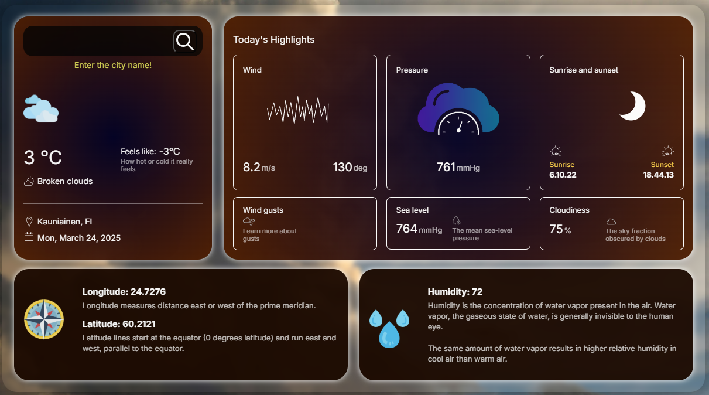

# SimpleWeatherApp

SimpleWeatherApp is a simple weather forecast application (SPA) developed using Vue.js, JS, and SCSS. 
It also features Lottie animations for a experience and integrates OpenWeatherMap API to fetch real-time weather data.

## Description

The application allows users to get up-to-date weather information for a selected city. It provides the following features:

- **City search:** Enter a city name to get the weather forecast.
- **Current weather display:** Temperature, humidity, wind speed, and weather conditions description.
- **Multi-day forecast:** Weather information for the upcoming days.
- **Open API Integration:** The application uses an open API key to fetch weather data from OpenWeatherMap.
- **Lottie Animations:** Smooth and lightweight animations enhance the user experience.

## Technologies

- **Vue.js:** JavaScript framework for building user interfaces.
- **SCSS:** CSS preprocessor for better-structured and maintainable styles.
- **Vite:** Modern and fast frontend build tool.
- **Lottie:** Animation library for seamless animated weather icons and effects.

## Project Structure

```
public/         # Static files
src/            # Application source code
  components/   # Vue components
  assets/       # Resources such as images, styles, and animations
  constants/    # API constants
  utils/        # Utility functions
index.html      # Main HTML file
package.json    # Project dependencies and scripts
vite.config.js  # Vite configuration
```

## Installation and Running

Clone the repository:

```sh
git clone https://github.com/Jackcubbi/SimpleWeatherApp.git
```

Navigate to the project directory and create a constants folder:

```sh
cd SimpleWeatherApp
mkdir -p src/constants && touch src/constants/index.js
```

Set and export constants in `index.js`:

```js
export const API_KEY = "your_api_key";
export const BASE_URL = "https://api.openweathermap.org/data/2.5/weather";
```

Install dependencies:

```sh
npm install
```

Run the application:

```sh
npm run dev
```

The application will be available at [http://localhost:5173](http://localhost:5173) or another port if specified.

## Build for Production

To build the application for production, run:

```sh
npm run build
```

The build files will be located in the `dist/` directory.

## Screenshot



## License

This project does not have a specified license. Please contact the author for more details.

